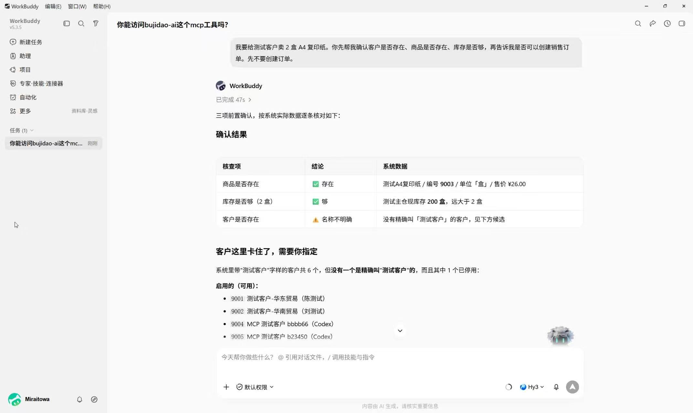
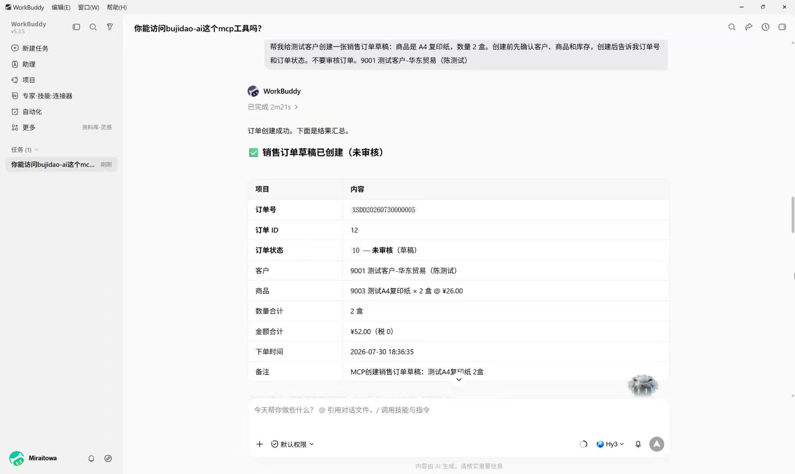

<div align="center">

# 🚀 bujidao-ai

**让企业现有业务能力，安全地成为 AI Agent 可调用的能力。**

基于 [ruoyi-vue-pro / 芋道源码](https://github.com/YunaiV/ruoyi-vue-pro) 的 AI 扩展项目，
在成熟的用户、租户、权限与 OAuth2 体系之上，增量补充面向真实业务场景的 AI 能力。

当前第一阶段聚焦 **ACF 能力治理 + Remote MCP Server**。

[](./LICENSE)


</div>

---

## 一眼看懂

`bujidao-ai` 不是重新开发一套独立的 AI 后台，而是在现有企业系统之上增加一层面向 AI / Agent 的能力治理与协议接入。

| 能力             | 作用                                                                      |
| -------------- | ----------------------------------------------------------------------- |
| **企业级基座**      | 复用 ruoyi-vue-pro 已有用户、租户、角色、菜单权限与 OAuth2 基础设施                           |
| **ACF 能力治理**   | 使用 `@AgentCapability` 将已有业务能力声明、注册并统一治理                                 |
| **权限控制**       | 根据当前登录用户原有业务权限决定 Agent 能看到、能调用哪些能力                                      |
| **执行治理**       | 提供权限校验、幂等控制、调用审计、Confirmation Challenge 等机制                             |
| **Remote MCP** | 将受治理的业务能力通过 MCP 暴露给 Codex、WorkBuddy 等 AI 客户端                            |
| **OAuth 接入**   | 支持 Authorization Code + PKCE、Dynamic Client Registration 等 MCP OAuth 流程 |
| **真实业务示例**     | 已提供商品、库存、客户、供应商、销售订单、采购订单等 ERP Capability 示例                            |

一句话理解整个项目：

```text
企业已有业务能力
        ↓
   @AgentCapability
        ↓
      ACF 治理
        ↓
权限 / 幂等 / 审计 / Challenge
        ↓
 Remote MCP Server
        ↓
 OAuth / PKCE / DCR
        ↓
AI Agent / MCP Client
```

---

## 💡 为什么做 bujidao-ai？

企业接入 AI Agent 时，真正的问题通常并不是：

> “怎么让大模型调用一个 Java 方法？”

而是：

> “怎么让 AI 在现有企业系统里，以正确的身份、正确的权限，安全地调用正确的业务能力？”

成熟的企业系统通常已经拥有：

* 用户与登录体系；
* 角色与菜单权限；
* 多租户体系；
* OAuth2；
* ERP、CRM、商城等业务模块；
* 完整的 Service 与业务校验逻辑。

如果只是给 MCP Server 临时注册几个 Tool，很快就会遇到新的问题：

* 哪些业务能力允许暴露给 Agent？
* 不同用户应该看到哪些 Tool？
* Agent 调用是否继续遵守 Web 端权限？
* 写操作失败后如何避免重复执行？
* 高风险操作是否需要确认？
* 谁在什么时候调用了什么能力？
* MCP OAuth 如何与现有用户和租户体系结合？

`bujidao-ai` 的思路不是绕开现有企业后台重新造一套 AI 系统，而是：

**继续让业务 Service 负责业务逻辑，让原有权限体系负责身份与授权，在它们之上增加统一的 AI 能力治理层。**

然后再通过 MCP 等协议，将这些受治理的能力开放给外部 Agent。

---

## 🧩 当前能力

当前项目第一阶段已经完成 **ACF + Remote MCP** 的基础闭环。

### ACF 能力治理

业务模块可以通过 `@AgentCapability` 声明允许 Agent 调用的能力。

例如，一个企业系统可以逐步将：

```text
查询商品
查询库存
查询客户
创建销售订单
查询采购订单
统计业务数据
```

转换成统一受治理的 Agent Capability。

ACF 当前提供：

* Capability 声明；
* Capability 注册与同步；
* Capability 元数据；
* 入参与输出 Schema；
* 权限契约；
* 统一执行链；
* 幂等控制；
* Confirmation Challenge；
* 调用日志与审计。

业务能力仍然调用原有 Service 完成真正的业务处理，而不是为 Agent 重新实现一份业务逻辑。

---

### Remote MCP Server

项目提供 Remote MCP Server，可以将受治理的 Capability 暴露为 MCP Tool。

当前支持基础 MCP 能力：

* `tools/list`
* `tools/call`
* `resources/list`
* `resources/templates/list`

其中：

**`tools/list`**

会根据当前登录用户的权限，只返回该用户有权调用的能力。

**`tools/call`**

不会绕过业务治理直接执行方法，而是进入 ACF 执行链，再完成：

```text
Capability 查找
    ↓
权限校验
    ↓
参数处理
    ↓
幂等控制
    ↓
必要时 Challenge
    ↓
业务执行
    ↓
结果返回
    ↓
调用审计
```

因此，MCP 在这里承担的是 **AI 客户端与企业业务能力之间的协议边界**，而不是整个系统的架构中心。

---

### OAuth 与身份体系

Remote MCP 正式接入复用 ruoyi-vue-pro 已有的：

* 用户；
* 登录态；
* 租户上下文；
* 角色；
* 菜单 / 按钮权限；
* OAuth2 Client；
* Authorization Code；
* Access Token；
* Refresh Token。

在此基础上增加 MCP 所需的协议适配，目前包括：

* Authorization Code；
* PKCE；
* Dynamic Client Registration；
* Resource Indicator；
* Redirect URI 校验；
* MCP OAuth Metadata；
* Token / Revoke 等相关 Endpoint。

默认通过 Dynamic Client Registration 让兼容的 MCP Client 动态注册 Public Client，不要求开源项目预置固定的 `client_id`。

---

### 权限复用

这是 `bujidao-ai` 当前设计中非常重要的一点。

假设企业原本已经有：

```text
erp:product:query
erp:stock:query
erp:sale-order:create
```

这些 Web 端权限。

对应业务能力开放给 Agent 后，不需要再维护一套完全独立的“AI 权限系统”。

ACF / MCP 会继续复用当前登录用户已有的业务权限：

```text
Web 用户权限
      ↓
ACF Capability 权限
      ↓
MCP tools/list 可见性
      ↓
MCP tools/call 二次校验
```

因此，同一个 MCP Server 面对不同用户时，可以看到不同的 Tool，也只能执行自己拥有权限的业务操作。

---

### 执行治理

除了“能不能调用”，真实业务还需要考虑“怎么安全调用”。

当前 ACF 已提供：

**幂等控制**

用于降低 Agent 重试、网络重试等情况下重复执行写操作的风险。

**Confirmation Challenge**

可以为高风险 Capability 增加执行前确认机制。

普通 MCP Client 通常无法展示自定义业务确认 UI，因此是否开启 Challenge 应根据具体客户端和业务场景决定。

**调用审计**

Capability 调用会产生调用日志，用于记录执行结果并支持后续问题排查和审计。

---

## 🔄 整体架构

```text
┌──────────────────────────────────────────────┐
│               企业业务模块                  │
│                                              │
│  ERP / CRM / Mall / OA / 自定义业务模块      │
│                                              │
│           Service / Domain Logic             │
└─────────────────────┬────────────────────────┘
                      │
                @AgentCapability
                      │
                      ▼
┌──────────────────────────────────────────────┐
│                  ACF                         │
│                                              │
│  Capability Registry                        │
│  Permission                                 │
│  Idempotency                                │
│  Confirmation Challenge                     │
│  Invocation Audit                           │
└─────────────────────┬────────────────────────┘
                      │
                ACF Tool Provider
                      │
                      ▼
┌──────────────────────────────────────────────┐
│             Remote MCP Server                │
│                                              │
│        tools/list       tools/call           │
│        resources/*     OAuth Metadata        │
└─────────────────────┬────────────────────────┘
                      │
              OAuth / PKCE / DCR
                      │
                      ▼
┌──────────────────────────────────────────────┐
│              AI / Agent Client               │
│                                              │
│       Codex / WorkBuddy / MCP Client         │
└──────────────────────────────────────────────┘
```

底层身份、租户和权限能力继续复用 ruoyi-vue-pro：

```text
User
Tenant
Role
Menu Permission
OAuth2
```

也就是说，AI Agent 最终调用的仍然是企业原本的业务系统，而不是一套脱离原系统重新建设的“AI 数据孤岛”。

---

## 🧪 真实业务闭环

项目目前使用 ruoyi-vue-pro ERP 模块提供了一组 Capability 示例，用于验证完整的企业业务调用链路。

示例覆盖：

* 商品；
* 库存；
* 客户；
* 供应商；
* 仓库；
* 销售订单；
* 采购订单；
* 业务统计等。

ERP 只是示例业务域。

如果你的项目没有使用 ERP，不需要迁移这些 Capability，只需要按照同样的模式，在自己的业务模块中声明能力即可。

### WorkBuddy 调用示例

下面展示 WorkBuddy 通过 Remote MCP 调用 `bujidao-ai` ERP 能力的真实流程。

首先由 Agent 查询并核验客户、商品和库存：



确认业务信息后，继续调用写能力创建销售订单草稿：



这也是项目当前希望验证的核心闭环：

```text
自然语言需求
    ↓
Agent 理解任务
    ↓
发现当前用户可用 Tool
    ↓
调用企业真实业务能力
    ↓
沿用原有权限与业务规则
    ↓
完成企业业务操作
```

---

## 🎯 适合谁使用？

### 已经使用 ruoyi-vue-pro / 芋道源码的项目

如果你的企业后台已经建立在芋道源码之上，可以通过增量方式引入 ACF 与 MCP，而不需要重新搭建整套后台基础设施。

### 希望让 Agent 调用内部系统的团队

例如希望让 AI：

* 查询订单；
* 查询客户；
* 查询库存；
* 创建业务单据；
* 调用审批能力；
* 执行内部运营操作。

同时又希望这些操作继续遵守已有权限、租户和业务规则。

### 正在研究企业级 MCP 的开发者

如果你已经能够写一个 MCP Tool，但正在思考：

```text
权限怎么办？
OAuth 怎么接？
多租户怎么办？
调用怎么审计？
写操作怎么保证安全？
几十、几百个 Tool 怎么治理？
```

这个项目可以作为一个完整的 Java 企业工程参考。

### AI 应用与 Agent 基础设施开发者

项目后续还会继续探索 RAG、Agent Runtime、Knowledge、Memory 等能力，并保持它们之间清晰的模块边界。

---

## ⚡ 快速开始

### 环境要求

后端当前主线：

* Java 17
* Spring Boot 3.5.x
* Maven
* MySQL
* Redis

前端：

* Vue3
* Node.js
* pnpm

具体 Node.js 与 pnpm 版本请以 [`frontend/package.json`](./frontend/package.json) 为准。

---

### 1. 克隆项目

```bash
git clone https://github.com/itkdm/bujidao-ai.git
cd bujidao-ai
```

---

### 2. 初始化数据库

首先按照 ruoyi-vue-pro 的方式准备基础数据库。

随后执行本项目维护的增量 SQL：

```text
sql/mysql/20260730_bujidao_ai_acf_mcp.sql
```

详细说明：

[sql/README.md](./sql/README.md)

该 SQL 只维护 `bujidao-ai` 自己新增的 ACF / MCP 数据结构和管理菜单，不重复维护 ruoyi-vue-pro 原有数据库结构。

---

### 3. 启动后端

```bash
cd backend

mvn package -DskipTests -pl yudao-server -am

java -jar yudao-server/target/yudao-server.jar \
  --spring.profiles.active=local
```

数据库、Redis、OAuth、MCP 域名等配置请根据自己的运行环境调整。

---

### 4. 启动前端

```bash
cd frontend

pnpm install

pnpm dev
```

启动后，可以在管理后台查看：

* ACF 能力目录；
* ACF 调用日志；
* MCP OAuth 授权页面。

执行增量 SQL 后，需要为对应后台角色分配 ACF 管理权限。

---

## 🔌 接入已有芋道项目

如果你已经有自己的 ruoyi-vue-pro / 芋道源码项目，**不建议直接用本仓库覆盖原项目**。

推荐采用增量接入方式。

基本流程：

```text
已有 ruoyi-vue-pro 项目
        ↓
引入 ACF Starter
        ↓
引入 MCP Starter
        ↓
引入 ACF / MCP Module
        ↓
执行 bujidao-ai 增量 SQL
        ↓
在自己的业务模块声明 Capability
        ↓
复用原有业务权限
        ↓
配置 MCP OAuth
        ↓
使用真实 MCP Client 验证
```

主要需要接入：

```text
backend/yudao-framework/yudao-spring-boot-starter-acf
backend/yudao-framework/yudao-spring-boot-starter-mcp

backend/yudao-module-acf
backend/yudao-module-mcp
```

然后在需要开放给 Agent 的业务模块中增加：

```text
capability/
```

并使用：

```java
@AgentCapability
```

声明需要开放的业务能力。

详细接入过程已经整理成专门面向 Coding Agent 的执行手册：

👉 [CODING_AGENT_MCP_ACF_ADOPTION_GUIDE.md](./CODING_AGENT_MCP_ACF_ADOPTION_GUIDE.md)

你可以将这份文档交给 Coding Agent，让它根据目标 ruoyi-vue-pro 项目的实际版本和目录结构完成增量接入。

> ERP Capability 仅作为示例。如果你的业务系统不是 ERP，请在自己的 CRM、商城、OA 或其他业务模块中声明对应 Capability。

---

## 📁 项目结构

```text
bujidao-ai/
│
├── backend/                              # Java 后端
│   │
│   ├── yudao-framework/
│   │   ├── yudao-spring-boot-starter-acf/
│   │   │                                 # ACF 核心 Starter
│   │   │
│   │   └── yudao-spring-boot-starter-mcp/
│   │                                     # Remote MCP Server Starter
│   │
│   ├── yudao-module-acf/                 # ACF 管理与生产适配模块
│   ├── yudao-module-mcp/                 # MCP OAuth 与应用层适配
│   │
│   ├── yudao-module-erp/
│   │   └── .../capability/               # ERP Capability 示例
│   │
│   └── yudao-server/                     # 后端启动模块
│
├── frontend/                             # Vue3 管理后台
│   └── src/
│       ├── views/acf/                    # ACF 管理页面
│       └── views/mcp/sso/                # MCP OAuth 授权页
│
├── sql/                                  # bujidao-ai 正式增量 SQL
│
├── assets/readme/                        # README 示例截图
│
├── AGENTS.md                             # Coding Agent 项目上下文与规则
│
├── CODING_AGENT_MCP_ACF_ADOPTION_GUIDE.md
│                                         # ACF / MCP 增量接入手册
│
└── README.md
```

项目尽量沿用 ruoyi-vue-pro 原本的模块组织方式。

AI 能力优先以：

```text
yudao-module-*
```

的方式增量加入，而不是重新创造一套完全不同的工程结构。

---

## 🗺️ 项目方向

`bujidao-ai` 会逐步补充企业 AI 应用所需要的基础能力，但不会为了扩大功能列表而把不同领域强行混在一起。

### 当前主线

目前重点已经落地：

| 方向                          | 状态  |
| --------------------------- | --- |
| ACF Capability 声明与注册        | 已实现 |
| Capability 权限治理             | 已实现 |
| 幂等与调用审计                     | 已实现 |
| Confirmation Challenge      | 已实现 |
| Remote MCP Server           | 已实现 |
| MCP OAuth / PKCE            | 已实现 |
| Dynamic Client Registration | 已实现 |
| ACF 管理后台                    | 已实现 |
| ERP Capability 示例           | 已实现 |

### 后续方向

后续计划逐步探索：

* RAG；
* Knowledge / 企业知识库；
* Agent Runtime；
* Conversation / Execution；
* Agent Tool 管理；
* Memory；
* Trace / 可观测性；
* 更完整的 AI 管理后台。

这些能力目前**不属于第一阶段已经完成的交付范围**。

项目会保持几个核心领域之间的边界：

```text
RAG
Agent Runtime
Capability Governance
MCP Integration
Knowledge
Memory
Trace
```

它们可以协作，但不会被强行设计成一个巨大的单体抽象。

---

## 🔐 生产使用提醒

Remote MCP 涉及真实企业业务能力，部署到生产环境前请重点确认以下配置。

### MCP 对外地址

生产环境应配置真实 HTTPS 域名，包括：

* MCP Endpoint；
* OAuth Issuer；
* Authorization Endpoint；
* Token Endpoint；
* Registration Endpoint。

### Hosts 与 Origins

必须根据真实环境限制：

```text
allowed-hosts
allowed-origins
allowed-redirect-uri-prefixes
```

不要直接沿用开发环境的宽松配置。

### OAuth

正式 Remote MCP 推荐使用 OAuth 授权。

不建议长期采用：

```text
手动复制 Bearer Token
```

作为生产方案。

### Dynamic Client Registration

DCR 会复用并写入 ruoyi-vue-pro 已有的：

```text
system_oauth2_client
```

生产环境应根据企业安全要求限制 Redirect URI 与客户端来源。

### 权限

不要为了方便 Agent 调用而绕过现有权限系统。

推荐始终保持：

```text
当前登录用户
    ↓
现有角色 / 菜单权限
    ↓
Capability 可见性
    ↓
Capability 执行权限
```

### 高风险写操作

对于可能产生副作用的 Capability，建议根据业务场景组合使用：

* 权限校验；
* 幂等键；
* Confirmation Challenge；
* 调用审计。

---

## 🔄 与芋道源码的关系

`bujidao-ai` 不是 ruoyi-vue-pro 的替代品。

项目是在其成熟企业后台能力之上进行 AI 方向的增量扩展。

当前上游：

* 后端：[YunaiV/ruoyi-vue-pro](https://github.com/YunaiV/ruoyi-vue-pro) `master-jdk17`
* 前端：[yudaocode/yudao-ui-admin-vue3](https://github.com/yudaocode/yudao-ui-admin-vue3) `master`

项目会尽量保持：

* 上游目录结构；
* 模块组织方式；
* 用户与租户体系；
* 权限模型；
* OAuth2 基础设施；
* 原有业务开发模式。

AI 相关能力尽可能以增量方式加入，从而降低已有芋道项目的迁移和接入成本。

感谢芋道源码提供稳定、完整的开源企业应用基础。

---

## 🤝 参与贡献

`bujidao-ai` 目前仍处于持续建设阶段，欢迎通过 Issue 和 Pull Request 一起完善项目。

你可以参与：

* 🐛 Bug 修复；
* 🔐 权限、安全与 OAuth 改进；
* 🔌 MCP Client 兼容性适配；
* 🧩 新的 ACF Capability 示例；
* 🏗️ ACF / MCP 基础设施优化；
* 📚 文档完善；
* 🤖 RAG、Agent Runtime 等后续能力设计与实现。

如果你正在真实企业项目中接入 Agent / MCP，也欢迎提交 Issue 分享具体场景。

真实业务场景会比单纯增加功能列表更有价值。

---

## ☕ 支持项目

如果 `bujidao-ai` 对你的学习、开发或项目实践有所帮助，欢迎给项目一个 ⭐ Star。

如果你愿意，也可以通过下面的方式支持项目持续维护：

<table>
  <tr>
    <td align="center" width="50%">
      <strong>支付宝</strong><br />
      
    </td>
    <td align="center" width="50%">
      <strong>微信</strong><br />
      
    </td>
  </tr>
</table>

感谢每一位使用、反馈、贡献和支持这个项目的人。

---

## 📄 License

本项目采用 [MIT License](./LICENSE)。

---

<div align="center">

**如果这个项目对你有帮助，欢迎给它一个 ⭐ Star。**

也欢迎一起探索：

**当 AI Agent 真正进入企业系统以后，企业软件应该如何重新设计自己的能力边界。**

</div>
